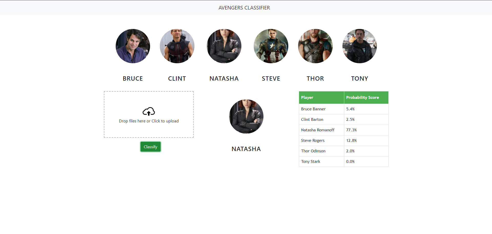

# Avengers Classifier

A web application that classifies images of Avengers characters using a machine learning model. Upload an image, and the app will predict which Avenger it is, displaying probability scores for each character.


## Features

- Upload an image and classify it as one of the Avengers (Bruce Banner, Clint Barton, Natasha Romanoff, Steve Rogers, Thor Odinson, Tony Stark).
- Displays probability scores for each character.
- Clean, modern UI with drag-and-drop image upload.
- Model success rate of ~70%



---

## Project Structure

```
.
├── model/                # Model training, saved model, and requirements
│   ├── Avengers_Classifier_Model.ipynb
│   ├── saved_model.pkl
│   ├── class_dictionary.json
│   ├── requirements.txt
│   └── ...
├── server/               # Backend Flask server
│   ├── server.py
│   ├── util.py
│   └── ...
├── UI/                   # Frontend files
│   ├── app.html
│   ├── app.js
│   ├── app.css
│   ├── dropzone.min.js
│   ├── dropzone.min.css
│   └── images/
├── GIF_Demo.gif          # Demo GIF
├── ui_snapshot.png       # UI Screenshot
└── ...
```

---

## Setup Instructions

### 1. Clone the Repository

```bash
git clone https://github.com/Abhay-Mmmm/Avengers-Classifier.git
cd Abhay's AvengerClassifier
```

### 2. Backend Setup (Flask + Model)

1. **Create a virtual environment (recommended):**
    ```bash
    python -m venv venv
    source venv/bin/activate  # On Windows: venv\Scripts\activate
    ```

2. **Install dependencies:**
    ```bash
    pip install -r model/requirements.txt
    pip install flask flask-cors
    ```

3. **Run the Flask server:**
    ```bash
    cd server
    python server.py
    ```
    The server will start at `http://localhost:5000`.

---

### 3. Frontend Setup

1. **Open the UI:**
    - Open `UI/app.html` directly in your browser.
    - Make sure the Flask server is running in the background.

2. **(Optional) Serve the UI with a local server:**
    - You can use any static server (like `http-server` for Node.js or Python's `http.server`).
    - Example with Python:
      ```bash
      cd UI
      python -m http.server 8000
      ```
      Then visit `http://localhost:8000/app.html`.

---

### 4. Usage

- Drag and drop an image of an Avenger or click to upload.
- Click the "Classify" button.
- The predicted character and probability scores will be displayed.

---

## Notes

- Ensure all images in `UI/images/` are present for the UI to display correctly.
- The backend uses a pre-trained model (`model/saved_model.pkl`). If you wish to retrain, use the Jupyter notebook in `model/Avengers_Classifier_Model.ipynb`.
- The server expects images in base64 format from the frontend.

---

## Dependencies

- Python 3.x
- Flask
- Flask-CORS
- PyWavelets
- OpenCV (`opencv-python`, `opencv-python-headless`)
- Seaborn

Install all Python dependencies with:
```bash
pip install -r model/requirements.txt
pip install flask flask-cors
```

---

## License

MIT License (or specify your license here)

--- 

Made with ❤️ by Abhay
